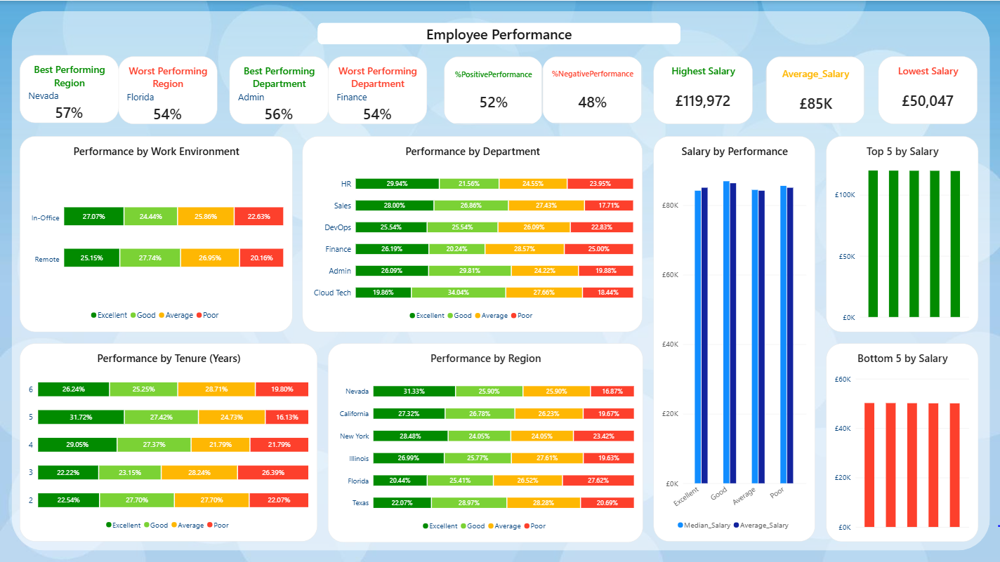

   

# Employee_Dataset
  
A project using an artificial employee dataset to demonstrate and refine my abilities in Excel and Power BI.  

## Contents
- [Purpose](#purpose)  
- [Objectives](#objectives)  
- [Skills](#skills)
- [Key Insights](#key-insights)  
- [Previews](#previews)
- [Final Project](#final-project)

## Purpose
The purpose of this project is to demonstrate my ability to clean, transform, analyse, and visualise employee data using Excel and Power BI.

## Objectives

- Clean and prepare employee data for analysis.
- Identify and address data-quality issues within the dataset.
- Analyse employee performance across different characteristics.
- Compare performance across departments and regions.
- Identify groups that may require further investigation.
- Create DAX calculated columns and measures to support analysis.
- Develop KPIs to provide an overview of employee performance.
- Use data visualisations to communicate key findings clearly.
- Create an interactive Power BI dashboard.

## Skills
|  |  |
|---|---|
| Power BI | Interpreting results |
| Excel | Story-telling |
| KPI development | Communicating insights clearly |
| Data modelling | Visualisation |
| Dashboard development | Providing post-explanation |
| Dax & Calculated measures | Analytical thinking |
| Exploratory Data Analysis | Investigating data quality |
| Statistical analysis | Data cleaning |

## Key Insights

- The best-performing region is Nevada, with 57% positive performance, whilst the worst-performing region is Florida, with 54% negative performance.
- The best-performing department is Admin, with 56% positive performance, whilst the worst-performing department is Finance, with 54% negative performance.
- The best performance by tenure is among employees with 5 years of tenure, whilst the worst performance is among employees with 3 years of tenure.
- Remote workers have slightly better performance than those working in-office.
- Overall, 52% of employees have positive performance, whilst 48% have negative performance.
- The highest-earning salaries by performance are among employees with Good performance, whilst the lowest-earning salaries are among employees with Average performance.
- The majority of the bottom 5 earning salaries are in Cloud Tech and Finance, whilst the majority of the top 5 earning salaries are in Sales, although they are more varied across departments.
- The average salary is £85K, whilst the highest-earning salary is £120K and the lowest-earning salary is £50K.

In a professional setting, my recommendations would be to investigate why Nevada is the best-performing region and why Admin is the best-performing department, and identify whether any of the factors contributing to their performance could be applied to lower-performing regions and departments. I would also recommend investigating how less experienced employees could be better supported to understand whether a lack of experience is contributing to lower performance, and handle it appropriately if so. I would also recommend gathering feedback from in-office employees to understand whether changes to the working environment could help improve their performance.

## Previews

## Final Project

  
###### Original dataset available in repository
